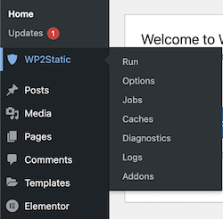
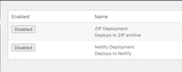
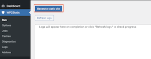
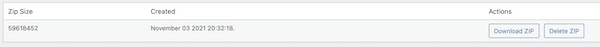
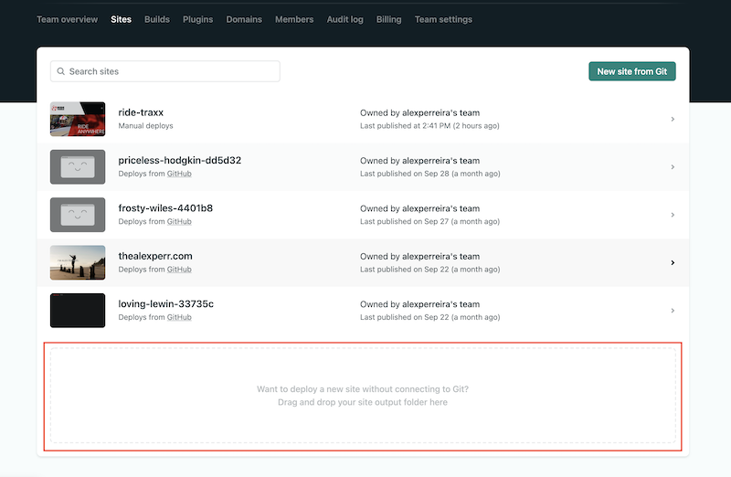
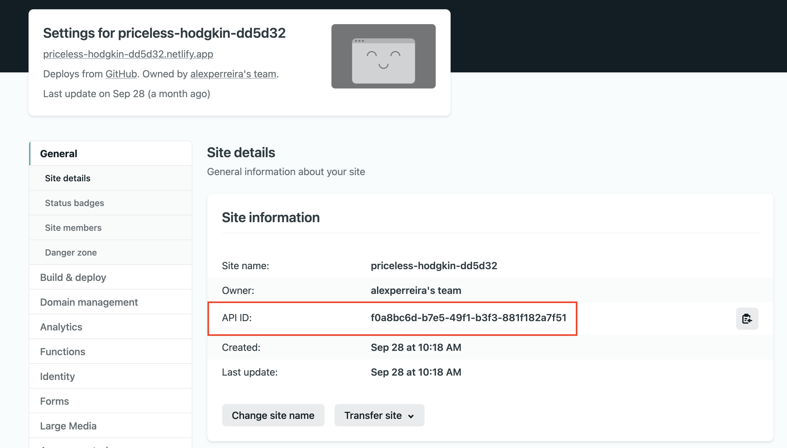
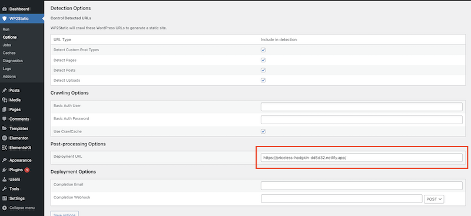

# How to deploy Static Wordpress sites from Local to Netlify

## Required plugins:

1. wp2static core 7.1.6
2. wp2static Zip Deployment Addon 1.0.1
3. wp2static Netlify Deployment Addon 1.0.1

`These files are provided in this repo. Current as of 11-03-2021.`

- wp2static addon

* wp2static addon netlify

Plugins can be found at [https://wp2static.com/thanks-for-donating/](https://wp2static.com/thanks-for-donating/)

- Once you have downloaded the zip files, use the `upload plugin` function in WP Dashboard.
- `Ensure all plugins are activated.`

## 1. WP2Static should have its own section in the menu admin bar now.

- 
   
   

## 2. Navigate to Addons

- You should see 2 addons, Zip Deployment and Netlify Deployment.
- 

- Both will be disabled. `Enable ZIP Deployment.`
   
   

## 3. Return to the admin menu and under WP2Static hit Run and Generate Static site.

- 
   

## 4. Under Addons (under Zip Deployment addon) click on the gear icon under Configure.

- 
- `Download the zip file.`
   
   

---

 
 

## 5. Navigate to Netlify. Create an account and go through set up steps.

## 6. Under the 'Sites' tab at the bottom of your websites you should see a section to upload websites. Upload the zip file we downloaded in `Step 4`.

- 

## 7. Follow the prompts and deploy site to Netlify.

- At this point the live site will be broken: formatting, styling, content. etc.
   
   

# Part 2. Deploying final static site to Netlify

 

## 1. Navigate to your Netlify Account > Applications > Personal Access Tokens > `New access token.`

- Name the access token whatever you like, generate, and `copy the token to your clipboard.`
   
   

## 2. Navigate to WP2Static > Addons > `Enable Netlify Deployment`.

- Navigate to the gear icon under configure and paste your `personal access token.`
- You also need your `site ID`, which is the `API ID` provided by Netlify under `site settings`.
   
   

- 
   
   
- Paste in the API ID under Site ID in Netlify Deploy Config.
   
   

## 3. Navigate to WP2STatic > Options > Post-processing Options.

- Add your site URL under Deployment URL.
- 
   
   

## 4. Navigate to WP2Static > Run > `Generate Static Site`

 
<bt />

# Your site should be live with all content, styles, and settings.
